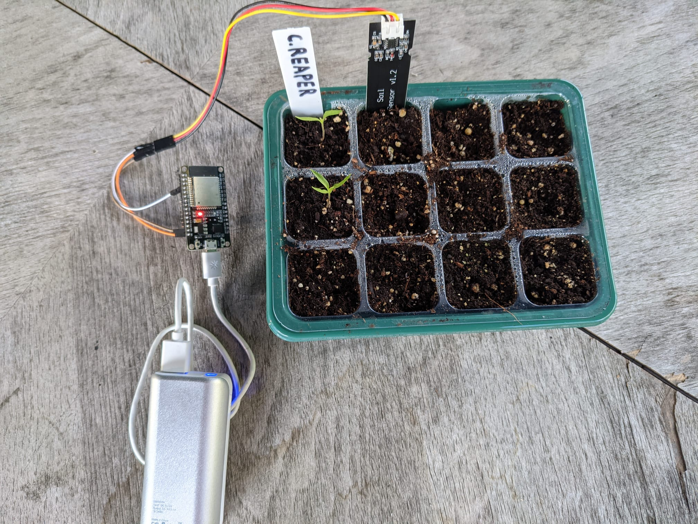
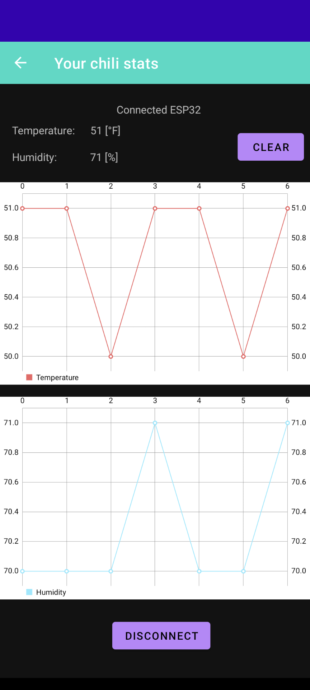

# ChilliBook
This repository is a simple humidity and temperature dashboard to present data from sensors on your phone.
It uses Bluetooth LE and an ESP32 development kit programmed with Arduino.

The repository also includes the Arduino sketch used to program the ESP32.
 
I use this app to check the temperature and humidity of my chili plants.
This app is only a proof of concept, and I will add more functionality later.
Currently, I am only interested in some statistics of humidity and temperature to keep my plants happy

## The controller

## The app dashboard

